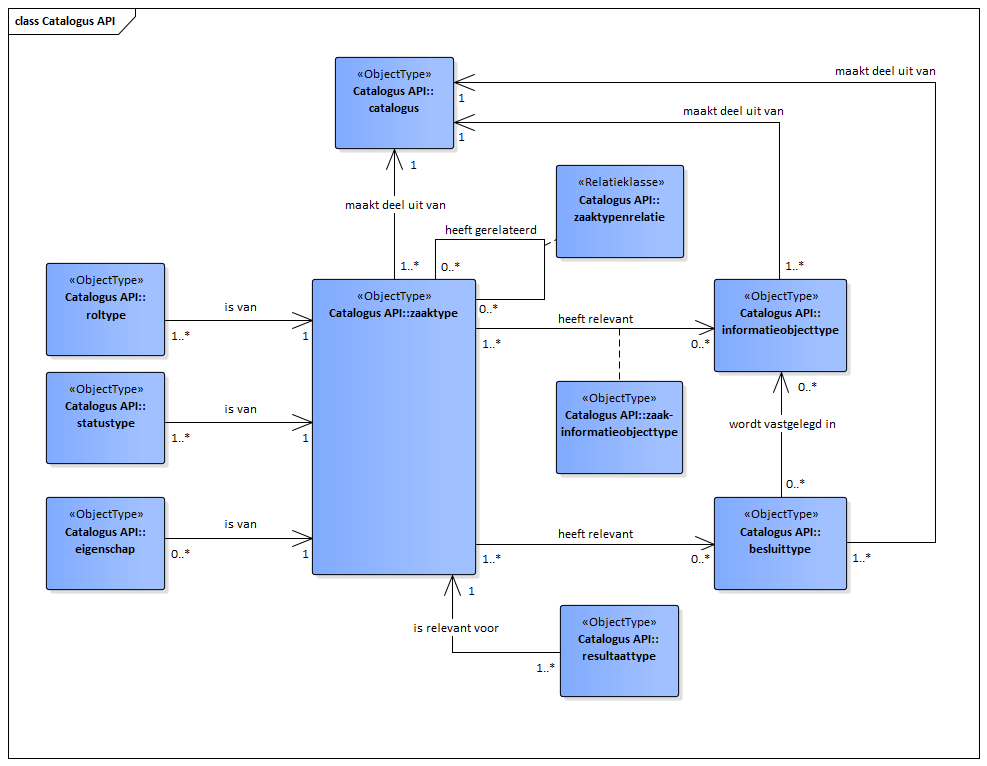

API voor opslag en ontsluiting van zaaktype-catalogi, zaaktypen en onderliggende typen.

De API ondersteunt het opslaan en naar andere applicaties ontsluiten van zaaktype-catalogi met zaaktypen. Deze gegevens kunnen door applicaties worden gebruikt om voor zaken van een bepaald type de juiste gegevens (statustypen, resultaattypen, informatieobjecttypen, etc.) te bepalen. Applicaties die gebruik maken van deze zaaktypegegevens zijn bijvoorbeeld een zaakafhandelcomponent, een VTH-applicatie of een subsidie-applicatie. Opslag van zaaktypegegevens vindt plaats conform het informatiemodel ZTC.

## Gegevensmodel

## Specificatie van de Catalogi API

[Referentie-implementatie Catalogi API](https://catalogi-api.vng.cloud)

[Plain text OAS3 specificatie](../../../api-specificatie/ztc/openapi.yaml)

## Specificatie van gedrag

Zaaktypecatalogi (ZTC) MOETEN aan twee aspecten voldoen:

* de ZTC `openapi.yaml` MOET volledig geïmplementeerd zijn.

* het run-time gedrag beschreven in deze standaard MOET correct geïmplementeerd
  zijn.

Het ZTC haalt informatie uit selectielijsten en de Gemeentelijke Selectielijst
2017. Deze gegevens worden ontsloten in de
[VNG-referentielijsten-API](https://ref.tst.vng.cloud/referentielijsten/). Op
korte termijn zal deze API gesplitst worden in een referentielijsten-API en de
selectielijst-API (waar deze nu nog 1 API is)
[#3 on Github](https://github.com/VNG-Realisatie/VNG-referentielijsten/issues/3).

## OpenAPI specificatie

Alle operaties beschreven in [`openapi.yaml`](../../../api-specificatie/ztc/openapi.yaml)
MOETEN ondersteund worden en tot hetzelfde resultaat leiden als de
referentie-implementatie van het ZTC.

Het is NIET TOEGESTAAN om gebruik te maken van operaties die niet beschreven
staan in deze OAS spec, of om uitbreidingen op operaties in welke vorm dan ook
toe te voegen.

### Run-time gedrag

Bepaalde gedrageningen kunnen niet in een OAS spec uitgedrukt worden omdat ze
businesslogica bevatten. Deze gedragingen zijn hieronder beschreven en MOETEN
zoals beschreven geïmplementeerd worden.

#### **<a name="ztc-001">Valideren van `Zaaktype` ([ztc-001](#ztc-001))</a>**

Het attribuut `Zaaktype.selectielijstProcestype` MOET een URL-verwijzing naar
de `Procestype` resource in de selectielijst-API zijn, indien ingevuld.

#### **<a name="ztc-002">Valideren van `Resultaattype` ([ztc-002](#ztc-002))</a>**

Het attribuut `Resultaattype.resultaattypeomschrijving` MOET een URL-verwijzing
naar de `Resultaattypeomschrijving` resource in de referentielijsten-API zijn.
Het ZTC MOET de waarde van `Resultaattypeomschrijving.omschrijving` ontsluiten
(uit de selectielijst) als alleen-lezen attribuut
`Resultaattype.omschrijvingGeneriek`.

Het attribuut `Resultaattype.selectielijstklasse` MOET een URL-verwijzing zijn
naar de `Resultaat` resource in de selectielijst-API. Tevens MOET dit
`resultaat` horen bij het `procestype` geconfigureerd op
`Resultaattype.zaaktype.selectielijstProcestype`.

Indien `Resultaattype.archiefnominatie` niet expliciet opgegeven wordt, dan
MOET het ZTC deze afleiden uit `Resultaat.waardering` van de
selectielijstklasse.

Indien `Resultaattype.archiefactietermijn` niet expliciet opgegeven wordt, dan
MOET het ZTC deze afleiding uit `Resultaat.bewaartermijn` van de
selectielijstklasse.

**`Resultaattype.brondatumArchiefprocedure`**

Het groepattribuut `Resultaattype.brondatumArchiefprocedure` parametriseert
het bepalen van de `brondatum` voor de `archiefactietermijn` van een zaak. Deze
parametrisering is aan validatieregels onderhevig:

* `Resultaattype.brondatumArchiefprocedure.afleidingswijze`:
    * afleidingswijze MOET `afgehandeld` zijn indien de selectielijstklasse
      als procestermijn `nihil` heeft en vice versa
    * afleidingswijze MOET `termijn` zijn indien de selectielijstklasse
      als procestermijn `ingeschatte_bestaansduur_procesobject` heeft en vice
      versa

* `Resultaattype.brondatumArchiefprocedure.datumkenmerk`
    * MOET een waarde hebben als de afleidingswijze `eigenschap`, `zaakobject`
      of `ander_datumkenmerk` is
    * MAG GEEN waarde hebben in de andere gevallen

* `Resultaattype.brondatumArchiefprocedure.einddatumBekend`
    * MAG GEEN waarde hebben indien de afleidingswijze `afgehandeld` of
      `termijn` is

* `Resultaattype.brondatumArchiefprocedure.objecttype`
    * MOET een waarde hebben als de afleidingswijze `zaakobject`
      of `ander_datumkenmerk` is
    * MAG GEEN waarde hebben in de andere gevallen

* `Resultaattype.brondatumArchiefprocedure.registratie`
    * MOET een waarde hebben indien de afleidingswijze `ander_datumkenmerk` is
    * MAG GEEN waarde hebben in de andere gevallen

* `Resultaattype.brondatumArchiefprocedure.procestermijn`
    * MOET een waarde hebben indien de afleidingswijze `termijn` is
    * MAG GEEN waarde hebben in de andere gevallen

## Overige documentatie

* [Informatiemodel Zaaktypen (ImZTC)](https://www.gemmaonline.nl/index.php/Informatiemodel_Zaaktypen_(ImZTC))
